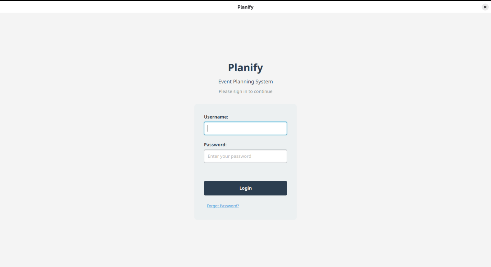
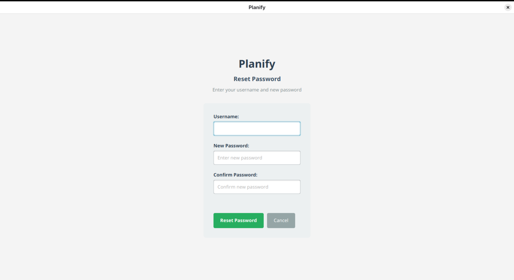
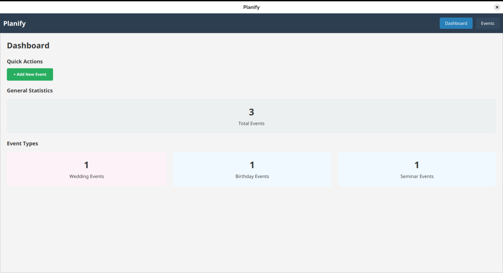
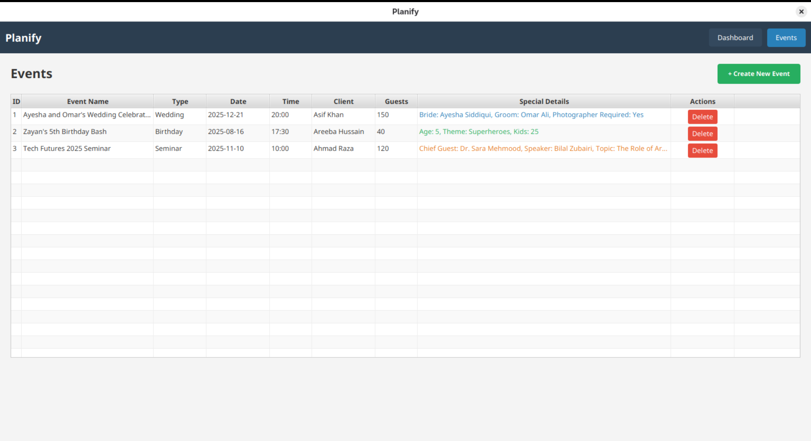
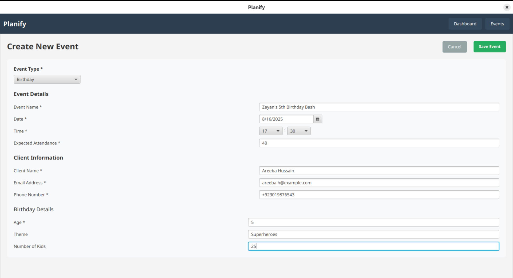
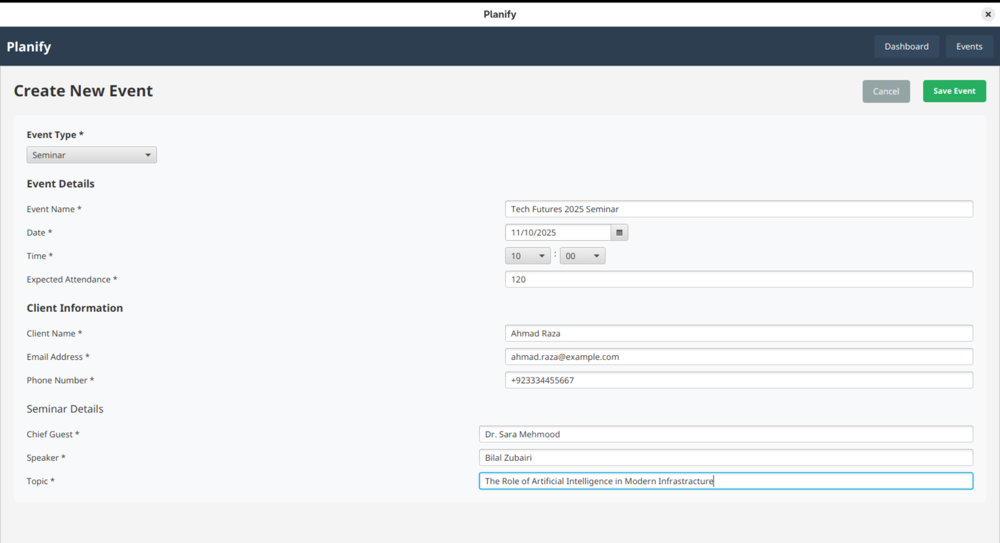
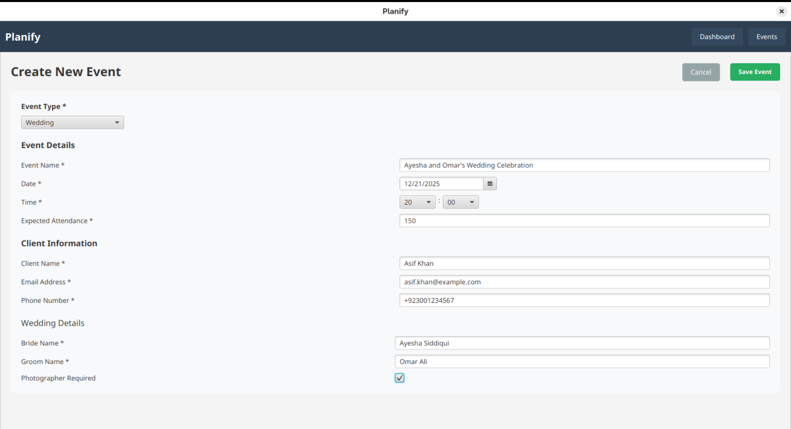

<h1 align="center">Welcome to Planify 👋</h1>
<p>
  
  <a href="URL" target="_blank">
    
  </a>
  <a href="URL" target="_blank">
    
  </a>
  <a href="https://twitter.com/notabdulkareem" target="_blank">
    
  </a>
</p>

> An Event Building and Management System written in Java and JavaFX.

### ✨ [Demo](URL)

## Features
- Admin Panel for User Login with Password Hashing.
- Dashboard with statistics. 
- Quick Links to View/Add Events.
- View Events page with complete detail of all events.
- Multiple Event Types Supported with unique fields for each.
- Creation and Deletion of Events
- Database driven operations using asynchronous queries.

## Screenshots
- Login Page


- Reset Password


- Dashboard


- Events Dashboard 


- Birthday Event


- Seminar Event


- Wedding Event

## Install

### Prerequisites
- Java Development Kit (JDK) 21 or higher.

#### 1. Clone the Repository 
```sh
git clone https://github.com/abdulkareemakn/Planify
cd Planify
```

#### 2. Built the Project
```sh
mvn clean install
```

#### Run the Application
```sh
mvn javafx:run
```

## Project Structure

```
Planify
├── db                                 # The SQLite database file is stored here
├── resources                          # Contains screenshots
├── LICENSE                            # MIT License
├── mvnw
├── mvnw.cmd
├── pom.xml                            # Maven Build File
├── README.md
├── src
│   └── main
│       ├── java
│       │   └── org
│       │       └── example
│       │           └── planifyfx
│       │               ├── controller  # Controller Classes (EventController, DashboardController)
│       │               ├── deps        # Dependencies (DBFX-Framework)
│       │               ├── model       # Model Classes (Event, Client)
│       │               ├── repository  # DAO Classes for Database Integration
│       │               └── util        # Utility Classes (Statistics, SceneManager)
│       └── resources
│           └── org
│               └── example
│                   └── planifyfx
│                       ├── db         # Database Schema
│                       └── fxml       # FXML files

```

## Technologies Used
- **Language**: Java 21
- **Framework**: JavaFX
- **Styling**: JavaFX CSS
- **Build Tool**: Maven
- **Database**: SQLite
- **OOP Concepts**: Encapsulation, Abstraction, Inheritance, Generics

## Credits
This project uses the [DBFX-Framework](https://github.com/WaqarAhmad321/dbfx-framework) created by [Waqar Ahmad](https://github.com/WaqarAhmad321). The majority of the database operations were done using this framework. Do check it out.

## Author

👤 **Abdul Kareem**

* Website: abdulkareem.codes
* Twitter: [@notabdulkareem](https://twitter.com/notabdulkareem)
* Github: [@abdulkareemakn](https://github.com/abdulkareemakn)

## Show your support

Give a ⭐️ if this project helped you!

## 📝 License

Copyright © 2025 [Abdul Kareem](https://github.com/abdulkareemakn).<br />
This project is [MIT](https://github.com/abdulkareemakn/Planify/blob/main/LICENSE) licensed.
